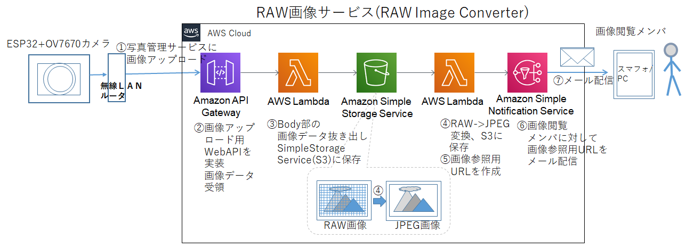

# RAW Image Converter 

RAW画像変換サービス(RAW Image Conver)は RAW形式の画像をJPEG形式に変換するWeb サービスで以下の機能があります。
1. RAW画像アップロード用APIを提供
1. アップロードされたRAW形式画像をJPEG画像に変換、S3に保存
1. AWS SNS (Simple Notification Service)を用いて画像参照用URLをメール連絡

本サービスは AWS Lambda Functionsで実装されています。処理フローを以下に示します。

RAW Image Converterは以下２種類のLambda関数で実現しています。
1. [uploader.py](src/uploader.py) WebAPIを提供するとともに、アップロードされたRAW形式画像をS3に保存します
1. [convertRawToJPG.py](src/convertRawToJPG.py) RAW形式画像をS3から取得してJPEG画像に変換しS3に保存します。 S3に保存された画像を参照するためのURLをSNS (Amazon Simple Notofication Service)を用いてユーザにメール連絡します

AWS Lambdaの設定手順が複雑なため、設定手順を以下にまとめています。記述が練れていなくて分かりにくいレベルですがご参照ください。
1. [AWS_Lambda_SetupGuide_ja.pdf](docs/AWS_Lambda_SetupGuide_ja.pdf)
1. [setup_Lambda_uploader_ja.pdf](docs/setup_Lambda_uploader_ja.pdf)
1. [setup_Lambda_convertRAWtoJPG_ja.pdf](docs/setup_Lambda_convertRAWtoJPG_ja.pdf)

converRawToJPG.pyを実行する上で画像変換ライブラリ(PIL)が必要です。AWS Lambda環境で使えるPILパッケージを作りました。[PILPackage/](PILPackage/)
から取得してください。以下２種類のバージョンを置いています。
1. [pillow_pkg_190923.zip](PILPackage/pillow_pkg_190923.zip)  テスト済み版（2020/2/22の時点ではPILパッケージバージョンが古くなっています）
1. [pillow_pkg_200209.zip](PILPackage/pillow_pkg_200209.zip)  未テスト版(2020/2/9時点での最新版ですがテスト未実施です)
構築手順も記載していますので、ご参考になさってください。

本システムの概要説明は、[Interface 2020 4月号](https://interface.cqpub.co.jp/magazine/202004/) Appendix-4 pp.90-95にも記載しています。併せてご参照ください。

すべてのファイル、ソースはMITライセンスに従っています。
All files are subject to MIT license.
